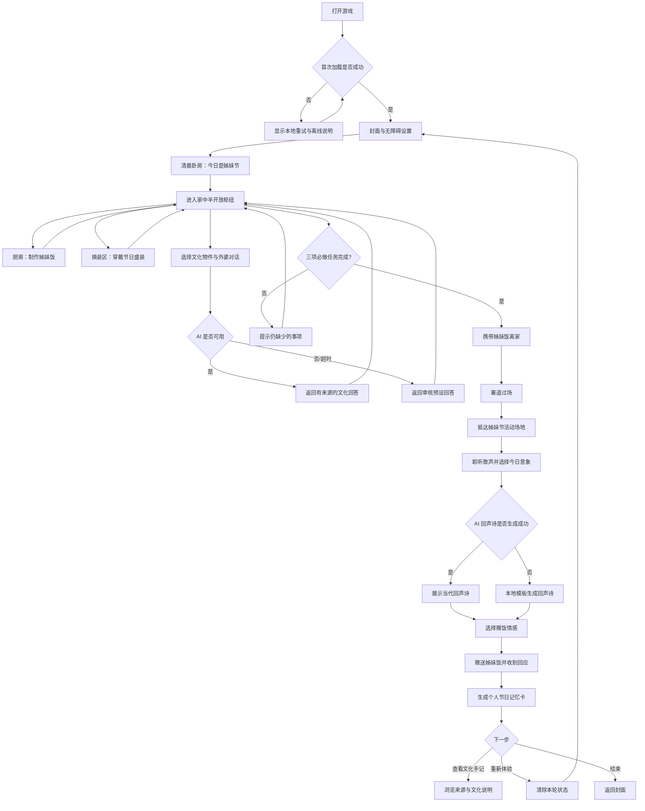
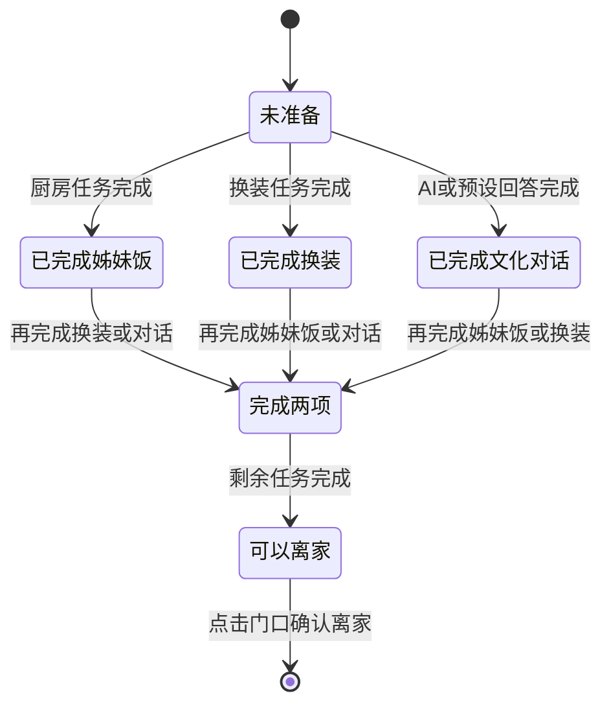

# 《她的姊妹节》PRD 与用户交互流程

> 文档版本：v0.1  
> 产品阶段：贵客松 48 小时 MVP  
> 平台：Web，横屏笔记本优先，兼容平板触摸  
> 体验时长：5–8 分钟  
> 文化范围：当代贵州省台江县施洞一带苗族姊妹节  
> 上位产品约束：见 `PRODUCT.md`

## 1. 产品概述

### 1.1 项目名称

《她的姊妹节》

### 1.2 一句话介绍

通过 AI 文化对话，亲历苗族女孩的姊妹节一天。

### 1.3 产品定义

《她的姊妹节》是一款当代贵州民族文化题材的 2D 绘本式 Web 游戏。玩家陪伴一名约 18 岁、在台江施洞长大的苗族女孩，经历她第一次独立准备并参加姊妹节的一天。

玩家在家中探索文化物件、制作姊妹饭、按真实规则穿戴节日盛装，再前往节日场地参与对歌并赠送姊妹饭。AI 只依据经过审核的施洞文化资料回答玩家的问题，并根据玩家当天的选择生成一段明确标注为当代创作的“回声诗”和个人节日记忆卡。

### 1.4 核心价值

- 从“观看民族文化”转向“亲手参与文化动作”。
- 展示传统文化如何存在于当代年轻人的真实生活，而不是将其冻结在过去。
- 用具体地点、具体节日和具体人物替代泛化的“苗族风情”。
- 让 AI 成为有资料边界的文化探索工具，而不是无依据地扮演当地人。

## 2. 背景与问题

现有民族文化传播常依赖展板、短视频、景区表演和百科文字，用户主要处于旁观位置。此类内容容易出现三类问题：

1. 文化知识与用户行动分离，看完后缺少可记忆的亲身经历。
2. 不同地区、支系和节庆元素被混合为统一的“民族风”。
3. 盛装、歌舞等视觉奇观被放大，普通人的当代生活被忽略。

本项目选择施洞姊妹节，是因为厨房准备、节日换装、女性参与、对歌和赠饭可以在同一个地点、同一个节日和同一天内自然形成完整体验。

## 3. 产品目标

### 3.1 MVP 目标

- 让首次接触该文化的玩家在 5–8 分钟内完成一条无中断主线。
- 让玩家至少亲手完成“制作姊妹饭、穿戴盛装、文化问答、对歌赠饭”四类动作。
- 让玩家理解至少三个事实：盛装具有特定使用场合；姊妹饭具有节日社交作用；苗族文化仍存在于当代生活中。
- 在网络或 AI 服务异常时，仍能依靠本地预设内容完整通关。
- 现场连续演示时无致命错误，重新开始后状态正确复位。

### 3.2 成功指标

| 指标 | MVP 目标 |
|---|---:|
| 首次体验完成率 | ≥ 85% |
| 主线体验时长 | 5–8 分钟 |
| 无提示完成必做任务比例 | ≥ 70% |
| AI 或网络失败后的可通关率 | 100% |
| 现场连续体验致命错误 | 0 |
| 通关后能说出至少 2 个文化要点的玩家比例 | ≥ 70%（现场抽样） |

### 3.3 非目标

- 不制作开放世界或完整苗寨模拟器。
- 不代表全部贵州苗族或全部苗族文化。
- 不做恋爱养成、好感度、攻略对象或配对结局。
- 不做复杂烹饪数值、体力、背包、货币和失败惩罚。
- 不在 MVP 中生成苗语、仿写传统苗歌或合成当地人声线。
- 不在 MVP 中强制使用摄像头、麦克风、账号或社交登录。
- 不制作自由混搭不同地区服饰的换装系统。

## 4. 用户与使用情境

### 4.1 核心用户

- 15–35 岁普通玩家。
- 对贵州苗族文化缺少系统了解。
- 喜欢轻叙事、绘本、互动故事或文化体验类内容。
- 在黑客松展位通过笔记本或平板首次接触游戏。

### 4.2 用户状态

玩家通常处于人多、嘈杂、时间有限的展会环境，注意力容易被打断。因此开场必须快速进入任务，声音不能是理解剧情的唯一渠道，任何单段文字不应过长。

### 4.3 核心用户任务

> 在不需要预先学习文化知识的情况下，完成女孩出门参加姊妹节的准备，并在节日现场做出一次带有个人表达的赠饭选择。

## 5. 角色与叙事设定

### 5.1 女主角

- 年龄：约 18 岁。
- 身份：在施洞长大，目前处于当代生活环境中。
- 今日事件：第一次独立准备并参加姊妹节。
- 内在状态：熟悉节日表面流程，但尚未认真思考自己为何愿意继续参与。
- 成长弧线：从“照着长辈做”转向“以自己的方式理解并继续参与”。

女主角姓名、苗语名及其准确发音暂不写死，须由当地文化顾问确认。

### 5.2 家庭角色

- 外婆：文化问答的叙事承载者。呈现为具体家庭成员，不塑造成无所不知的“民族百科”。
- 母亲：换装和出门准备的提示角色，负责说明场合与穿戴规则。

### 5.3 节日同伴

- 同龄姐妹：承担节日场地引导和群体氛围。
- 赠饭对象：保持性别和关系表达克制，可理解为重要同伴或含蓄感情对象，不进入恋爱攻略系统。

## 6. 体验原则

1. **先做再解释。** 玩家先操作，再在需要时获得简短解释。
2. **选择不等于考试。** 文化规则错误时温和提示并允许重选，不进行羞辱或扣分。
3. **单主线、软差异。** 所有玩家走向同一主题结局，过程选择改变对白、回声诗和记忆卡。
4. **日常与节日分开。** 日常发簪、便装和节日银饰不能混为同一使用场景。
5. **当代生活可见。** 手机、现代生活用品等可以自然存在，但不抢夺文化动作的注意力。
6. **AI 不冒充传统。** AI 生成内容必须标记为当代创作，传统知识必须可追溯到审核资料。

## 7. 信息架构与场景范围

### 7.1 场景清单

| 场景 | 核心目的 | 必做交互 | 可选交互 | 建议时长 |
|---|---|---|---|---:|
| S0 开场封面 | 建立人物、地点和今日目标 | 开始体验 | 字幕/音量/减少动态设置 | 15–20 秒 |
| S1 清晨卧房 | 进入角色，理解“第一次独立准备” | 起身、查看今日任务 | 手机消息、窗外环境 | 20–30 秒 |
| S2 家中枢纽 | 建立半开放探索空间 | 进入厨房和换装区 | 查看文化物件、AI 问答 | 30–45 秒 |
| S3 厨房 | 体验姊妹饭准备 | 选米、拌色、蒸制、装篮 | 查看酸汤坛等陈设 | 60–90 秒 |
| S4 换装区 | 理解日常与节日穿戴差异 | 分层穿戴节日盛装 | 查看服饰细节与来源 | 60–90 秒 |
| S5 门口/寨道 | 检查任务并进入室外 | 携带姊妹饭、离家 | 回屋继续探索 | 15–20 秒 |
| S6 节日场地 | 完成节日高潮 | 听歌、组织回应、赠饭 | 短节奏互动 | 90–120 秒 |
| S7 结尾 | 回收选择并形成记忆 | 查看回声诗和记忆卡 | 文化手记、重新体验 | 30–45 秒 |

### 7.2 室内空间

室内采用一个横向 2D 房间枢纽，不制作复杂自由移动。玩家通过点击热点在以下区域间切换：

- 卧房/换装区
- 堂屋与文化物件区
- 厨房
- 门口与走廊

具体房屋结构、火塘位置、陈设方式和施洞当地称谓须在美术制作前完成文化核验。

### 7.3 室外空间

MVP 仅制作两段：

- 从家门到节日场地的短寨道过场
- 姊妹节活动场地

不制作开放地图、自由寻路或与大量 NPC 对话。

## 8. 核心玩法需求

### 8.1 半开放任务枢纽

#### 规则

- 玩家进入家中后可自由选择先做饭或先换装。
- “完成姊妹饭”和“完成节日换装”为离家前必做任务。
- “与外婆完成至少一次文化对话”为必做任务，用于保证 AI 核心体验被触达。
- 其他物件探索为可选任务。
- 顶部或角落显示轻量任务提示，但不长期占据画面中心。

#### 反馈

- 已完成任务以图形和文字同时标记。
- 60 秒无进展时，环境中的对应入口出现一次温和动效提示。
- 点击门口但任务未完成时，母亲只提示缺少的事项，不重置进度。

### 8.2 姊妹饭制作

#### 目标

让玩家理解姊妹饭不是普通“彩色食物”，而是节日准备和社交表达的一部分。

#### 三段交互

1. **选米与颜色**：根据外婆留下的视觉提示选择所需糯米和颜色。颜色同时配有纹样与文字标签。
2. **拌色与蒸制**：拖拽完成拌色，并按正确顺序放入蒸具。首版不做高压计时。
3. **装篮**：将完成的糯米饭装入竹篮，用绣帕包好，并选择一个代表今日心情的色彩作为个人记忆变量。

#### 容错

- 顺序错误时立即提示原因并保留已完成步骤。
- 连续两次错误后显示明确操作指引。
- 不出现“失败的姊妹饭”或食物浪费结局。

#### 待核验

- 施洞姊妹饭的准确制作步骤。
- 天然染色材料、颜色含义及当代实际使用情况。
- 蒸具、竹篮、绣帕的当地形制。

### 8.3 节日换装

#### 目标

让玩家理解盛装具有明确的地域体系、穿戴层次和使用场合。

#### 分层结构

1. 衣裙
2. 围腰或绣片层
3. 发式与日常发簪
4. 节日头饰
5. 项圈、耳饰、手镯等银饰层

每层提供 2–3 个经过核验、属于同一施洞盛装体系的选项。不同选择只改变外观细节、外婆对白和最终记忆卡，不影响通关。

#### 交互

- 点击或拖拽服饰到人物对应部位。
- 穿戴成功后出现局部近景和一句场合/纹样说明。
- 不合适的顺序或场合由母亲说明原因，并允许直接调整。
- 完成后生成全身角色状态，延续到室外场景和结尾。

#### 待核验

- 施洞未婚青年女性姊妹节盛装的准确层次与穿戴顺序。
- 哪些银饰属于盛装专用，哪些可作为日常实用品。
- 具体纹样、饰物名称、含义和使用权限。

### 8.4 AI 文化对话

#### 目标

把文化知识嵌入家庭交流，而不是弹出百科页面。

#### 交互模式

- 玩家点击一个经过审核的物件，如银簪、绣片、姊妹饭竹篮或家屋构件。
- 界面提供 2–3 个建议问题，并允许玩家输入自由问题。
- 外婆角色以 2–4 句简短中文回答，只使用审核资料库中的事实。
- 回答底部显示“查看资料来源”，展开后展示机构与资料标题。
- 玩家必须完成至少一次对话才能出门。

#### AI 边界

- 不生成苗语翻译、苗语读音或传统苗歌内容。
- 不声称代表所有苗族或所有施洞家庭。
- 对资料库外的问题直接说明“这件事我不能确定”，并推荐可继续探索的已知物件。
- 涉及婚恋、祭祀、禁忌等内容时仅回答已审核事实，不进行价值判断。
- 输入内容仅用于当前会话，不建立用户画像，不要求登录。

#### 服务状态

| 状态 | 用户体验 |
|---|---|
| 正常 | 先显示外婆思考状态，目标 4 秒内返回回答 |
| 响应较慢 | 2 秒后显示“外婆想了想……”并允许继续查看物件 |
| 超时/离线 | 6 秒后切换到该物件的审核预设回答 |
| 无资料 | 明确说明无法确认，并展示两个可回答的建议问题 |
| 输入不适当 | 不复述内容，温和引导回当前文化物件 |

### 8.5 对歌与回声诗

#### 目标

让玩家根据当天经历做出个人表达，但不让 AI 冒充传统苗歌创作者。

#### 交互

1. 玩家聆听一段获得授权的当地歌声或演奏片段，并同步阅读字幕/背景说明。
2. 系统从玩家当天的行为中提取 3–5 个意象，例如所选颜色、询问的物件、服饰细节和赠饭心情。
3. 玩家从中选择 2–3 个意象，也可补充一句现代中文短句。
4. AI 生成 2–4 行现代中文“回声诗”。界面明确标注“由你今日的选择生成，并非传统苗歌”。
5. AI 不可用时使用模板化组合生成，不阻断后续赠饭。

### 8.6 赠送姊妹饭

#### 目标

将厨房、换装、文化探索和个人表达汇聚为一次行动。

#### 交互

- 玩家选择赠送时想表达的主要情感：感谢、思念、期待或祝福。
- 角色递出姊妹饭，对方以简短对白和动作回应。
- 不设置答错、被拒绝或好感度变化。
- 回应内容根据玩家的情感选择、姊妹饭主色和回声诗意象发生轻微变化。

涉及姊妹饭中具体物件的传统暗示，在完成施洞当地核验前不进入 MVP 文案。

## 9. AI 与文化资料架构

### 9.1 审核知识库

每条文化知识至少包含：

- `id`
- 主题与适用场景
- 已审核事实
- 禁止扩展或容易误解的边界
- 来源机构
- 来源标题与链接
- 审核人、审核日期和版本

### 9.2 回答策略

AI 先检索与所选物件和问题相关的审核条目，再基于检索结果回答。若没有足够依据，不得依靠模型常识补齐。

### 9.3 首批知识主题

- 姊妹节发生的时间、地点和主要活动
- 姊妹饭的节日作用
- 施洞苗族女盛装及银饰的使用场合
- 银簪、耳环、项圈、银衣片等已确认物件
- 苗绣、绣帕与文化传承
- 当代施洞年轻人的节日参与方式

### 9.4 初始公开资料

- [台江县人民政府：《姊妹节》](https://www.gztaijiang.gov.cn/cbagx/jrxs/202310/t20231019_82818665.html)
- [贵州省博物馆：《馆藏台江施洞苗族女盛装银饰》](https://zg.gzmuseum.com/gbyw/202507/1071.html)
- [台江县人民政府：《苗族酸汤》](https://www.gztaijiang.gov.cn/cbagx/tjly/msjs/202403/t20240320_83968488.html)
- [中国非物质文化遗产网·中国非物质文化遗产数字博物馆](https://www.ihchina.cn/)

公开资料只能作为原型依据。正式发布前须邀请施洞当地文化工作者、传承人或研究者复核角色、服饰、食物、语言、声音和场景。

## 10. 端到端用户交互流程

### 10.1 主流程图

### 10.2 室内任务状态流

注：实现时应分别存储三项布尔状态，流程图中的“完成两项”仅用于表达，不应简化为不可追溯的计数器。

### 10.3 逐步交互说明

| 步骤 | 玩家看到 | 玩家操作 | 系统反馈 | 状态变化 |
|---|---|---|---|---|
| 1 | 封面、项目名、开始按钮 | 点击开始或按 Enter | 淡入清晨卧房 | 建立新会话 |
| 2 | 女主、窗外晨光、手机消息 | 点击起身 | 显示今日三项准备 | 解锁家中枢纽 |
| 3 | 厨房、换装区、外婆和门口热点 | 自由选择入口 | 热点获得焦点和名称 | 无固定顺序 |
| 4 | 姊妹饭三段操作台 | 点击、拖拽、确认 | 即时步骤反馈 | `mealComplete=true` |
| 5 | 角色全身与分层服饰 | 点击或拖拽穿戴 | 角色外观实时更新 | `outfitComplete=true` |
| 6 | 外婆与选中的文化物件 | 选择建议问题或输入 | AI/预设回答和来源 | `dialogueComplete=true` |
| 7 | 门口、任务完成提示 | 点击离家 | 若缺任务则提示；完成则过场 | 锁定本轮室内选择 |
| 8 | 节日场地与歌声字幕 | 聆听并跟随一次节奏 | 音画同步反馈 | 解锁意象选择 |
| 9 | 今日收集的意象 | 选择 2–3 个，可补一句话 | 生成回声诗或本地替代 | 保存 `echoText` |
| 10 | 姊妹饭和赠送对象 | 选择表达并点击赠送 | 对方回应，无失败 | 保存 `giftIntent` |
| 11 | 个人记忆卡 | 查看、展开文化手记 | 展示选择摘要与来源 | 本轮完成 |

## 11. 页面与组件需求

### 11.1 全局界面

- 场景画面区
- 当前任务提示
- 字幕区
- 设置入口
- 音量/静音状态
- 文化手记入口（首次通关后常驻）
- AI 来源展开层

全局 UI 不采用古风卷轴和悬浮玻璃卡片。操作标签应使用现代、清晰、克制的产品界面语言。

### 11.2 交互热点

每个热点必须具备：

- 默认、悬停、键盘焦点、按下、已完成和不可用状态
- 图形与文字名称
- 至少 44×44 CSS 像素的可点击区域
- 不依赖颜色的状态表达

### 11.3 对话

- 单次显示不超过 4 行正文。
- 允许点击继续和键盘继续。
- 语音存在时字幕默认开启。
- AI 回答与编剧预设对白在视觉上保持角色一致，但 AI 回答需显示来源标记。

### 11.4 提示与教程

- 首次出现新操作时使用一次就地提示。
- 玩家成功完成一次后不重复提示。
- 不设置覆盖全屏的多页教程。
- 60 秒无进展才出现主动提示。

## 12. 视觉与声音方向

### 12.1 视觉策略

- 产品界面默认采用 `product` 类型，操作清晰优先于装饰展示。
- 场景使用“Committed”色彩策略：靛蓝承担主要识别色，但不把所有背景做成仿古米黄色。
- 2D 绘本式第三人称视角，角色在大多数场景中可见。
- 做饭、穿戴和赠饭切换为局部近景。
- 服饰、器物和建筑必须以真实参考素材为依据，不使用通用“民族风”素材包。

### 12.2 场景句

> 在明亮嘈杂的展会现场，一名第一次接触施洞姊妹节的玩家，通过横屏笔记本进入一座有晨光和真实生活痕迹的当代苗家木楼，安静陪女孩完成出门前的准备。

### 12.3 视觉参考方向

- 《Florence》：用短小、直觉化的动作推动情绪叙事。
- 《Dordogne》：以绘本画面承载地点记忆，但不照搬其水彩语言。
- 《Never Alone》：让文化知识与人物行动、环境和故事相互支撑。

这些作品只作为交互和叙事锚点，不作为苗族视觉资料来源。

### 12.4 动效

- 普通交互反馈控制在 150–250ms。
- 场景转换以遮挡、推镜或短交叉淡化为主。
- 银饰、蒸汽、布料和人群可使用局部环境动效，但不喧宾夺主。
- 支持 `prefers-reduced-motion`，减少动态模式下改为短淡入或即时切换。

### 12.5 声音

- 清晨环境、木楼脚步、厨房蒸汽、银饰轻响、节日远近人声。
- 飞歌、芦笙或木鼓素材必须确认具体地域、使用场合和授权。
- 默认提供静音入口，声音关闭后不影响任何任务判断。

## 13. 功能优先级

### 13.1 P0：必须完成

- 封面与新会话初始化
- 清晨卧房和家中枢纽
- 姊妹饭三段式小游戏
- 施洞节日盛装分层换装
- 至少 4 个文化物件及一次必做文化问答
- AI 超时和离线预设回答
- 室内任务检查与离家过场
- 节日场地、意象选择、回声诗生成
- 赠饭与单主题结局
- 个人节日记忆卡
- 字幕、键盘主流程和减少动态支持
- 重新体验与状态复位

### 13.2 P1：时间允许再做

- 文化手记及完整来源浏览
- 更多服饰细节选项
- 多组赠饭回应
- 更丰富的环境音与局部视差
- 本地匿名行为事件统计
- 记忆卡下载为图片

### 13.3 P2：赛后扩展

- 当地苗语的专业录音与字幕对照
- 更多施洞家庭、人物和日常故事
- 丹寨排莫蜡染等独立地区章节
- 贵州民族文化章节地图
- 经专业审核的多人文化共创内容

## 14. 数据与状态

### 14.1 会话状态

MVP 至少保存：

- 当前场景
- 姊妹饭完成状态及主色选择
- 换装完成状态及各层选项
- 已探索物件
- 已完成文化对话
- AI 对话上下文（仅当前会话）
- 回声诗意象与生成结果
- 赠饭情感选择
- 音量、字幕和减少动态偏好

### 14.2 隐私

- 无账号、无实名信息、无精确位置采集。
- 不默认保存自由输入内容。
- 不调用摄像头和麦克风。
- 若启用匿名分析，只记录场景进入、任务完成、错误和耗时，不记录对话正文。

## 15. 异常与边缘状态

| 场景 | 异常 | 处理 |
|---|---|---|
| 首次加载 | 素材未加载完成 | 显示可理解的加载进度；关键素材失败时允许重试 |
| AI 对话 | 网络失败或模型超时 | 6 秒内切换到对应物件的审核预设回答 |
| AI 对话 | 无相关资料 | 明确表示无法确认，并给出可回答问题 |
| AI 对话 | 自由输入过长 | 限制长度并保留已输入内容，提示缩短 |
| 做饭 | 操作顺序错误 | 就地说明并保留正确步骤，不重置整个小游戏 |
| 换装 | 选择顺序不合规则 | 角色说明场合或层次，允许即时调整 |
| 离家 | 必做任务未完成 | 高亮缺少事项，不移动到室外 |
| 音频 | 浏览器阻止自动播放 | 保持静音并提示点击后播放，字幕始终可用 |
| 回声诗 | AI 生成失败 | 使用本地模板组合已选意象 |
| 重新开始 | 上一轮状态残留 | 清除剧情状态，保留无障碍与音量偏好 |
| 小屏设备 | 横向空间不足 | 提示旋转为横屏；不阻止继续体验 |

## 16. 无障碍要求

- 目标达到 WCAG 2.2 AA。
- 正文与背景对比度不低于 4.5:1，大号文字不低于 3:1。
- 姊妹饭颜色同时使用名称、纹样或形状编码。
- 所有必做交互均可通过键盘完成，焦点状态清晰可见。
- 所有音频信息均有同步字幕或等价文字。
- 点击目标不小于 44×44 CSS 像素。
- 动效遵循减少动态偏好。
- 拖拽操作提供点击选择的等价方式。
- AI 等待状态、失败状态和来源标记可被辅助技术读取。

## 17. 技术假设

以下内容是 PRD 的默认实现假设，不构成最终技术选型：

- 前端为单页 Web 应用，桌面 Chromium 浏览器优先。
- 2D 场景、角色和热点使用 DOM/CSS 与 Canvas 的组合实现。
- AI 请求通过服务端代理，浏览器端不暴露模型密钥。
- 文化知识库存储为可版本化的结构化数据。
- 静态资源可预加载并缓存，AI 不可用时不影响主线。
- 不为 MVP 新增大型游戏引擎，除非后续证明原生实现无法满足交互或性能要求。

## 18. 验收标准

### 18.1 主流程

- 玩家可以从封面开始并在 5–8 分钟内抵达结尾。
- 做饭与换装顺序可以互换。
- 三项室内必做任务全部完成前不能离家。
- 完成任务后门口状态明显变化，玩家无需额外说明即可继续。
- 室外流程能够正确读取室内选择并反映在角色外观、意象和记忆卡中。

### 18.2 AI

- 每个 AI 事实回答可追溯到审核知识条目。
- 模型不得在无资料时补写苗语、苗歌、习俗或物件含义。
- AI 请求超时后自动使用预设内容，玩家无需刷新页面。
- 回声诗明确标注为当代生成内容，不称为传统苗歌。

### 18.3 状态与稳定性

- 重新体验后剧情状态、服饰、姊妹饭和回声诗全部复位。
- 刷新页面后的处理方式明确：MVP 默认重新开始，并给出提示。
- 连续完成至少 10 次完整体验，无不可恢复错误。
- 断网情况下除自由 AI 对话外仍能完成全流程。

### 18.4 可用性

- 首次玩家能识别厨房、换装区、外婆和门口四类关键热点。
- 不阅读文化手记也能理解主线。
- 静音、键盘和减少动态模式下均可通关。

## 19. 内容与美术资产清单

### 19.1 P0 场景资产

- 清晨卧房
- 家中堂屋/枢纽
- 厨房操作近景
- 换装全身与局部近景
- 门口和寨道过场
- 姊妹节活动场地
- 结尾记忆卡背景

### 19.2 P0 角色资产

- 女主日常状态
- 女主盛装分层资产
- 外婆
- 母亲
- 同龄姐妹和赠饭对象
- 节日人群远景

### 19.3 P0 物件资产

- 姊妹饭原料、蒸具、竹篮、绣帕
- 施洞女盛装各层与已核验银饰
- 4–6 个可问答文化物件
- 手机等少量当代生活物件

所有正式资产必须保存参考来源、适用地区和审核状态。

## 20. 待文化核验清单

以下内容在核验前不得作为确定事实进入正式文案或美术：

1. 女主角姓名、苗语名及发音。
2. 施洞当地姊妹饭的完整制作流程、色彩材料和寓意。
3. 姊妹饭中夹带物件所表达的具体含义及当代使用情况。
4. 未婚青年女性姊妹节盛装的穿戴顺序、名称和使用边界。
5. 家屋平面、厨房、火塘、储藏和室内陈设的施洞本地形态。
6. 节日场地的真实空间、参与顺序和女性角色活动范围。
7. 飞歌、芦笙、木鼓等声音素材的具体地域归属和授权。
8. 对歌环节是否适合当前角色设定，以及当代年轻人的真实参与方式。
9. 文化物件对应的准确称谓、纹样和来源故事。

## 21. 后续执行顺序

1. 邀请施洞当地文化顾问核验第 20 节内容。
2. 根据核验结果冻结故事脚本、服饰分层和姊妹饭步骤。
3. 制作低保真可点击流程，验证 5–8 分钟节奏。
4. 建立首批审核知识库和离线预设回答。
5. 完成 P0 功能闭环，再替换正式美术与声音。
6. 进行断网、重复体验、键盘和现场噪声环境测试。
